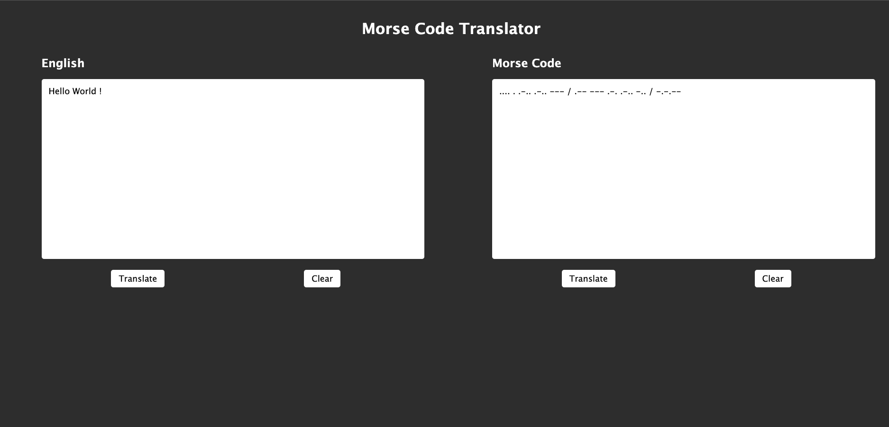

# Morse Translator

The Morse Translator app allows users to translate text into Morse code and vice versa. It has a simple and intuitive interface, with two text input field where users can enter either English text or Morse code, and press the translate button that converts the text to the other format. The app is built using JavaScript, HTML, and SCSS. It is also utilize Jest for testing the translating functions.

## Screenshots

<figure>
<figcaption><i>Main Page</i></figcaption>

</figure>

---

## Requirements / MVP

- Create a user interface that allows the user to either input some English text or some Morse Code
- Create JS functions that would allow the user to:
  - translate their English text into Morse Code
  - Morse Code into English text
- Make sure to add unit tests for your translating functions
- Make sure to handle spaces properly (ie. there is 1 space between English words, but one space between Morse Code characters)

---

## Getting Started

To get started with this project, clone the repository and install the dependencies:

`git clone git@github.com:matheuslincon/fakeos-nology.git`

`cd fakeos-nology`

You can now open the index.html file in your local repository folder.

---
